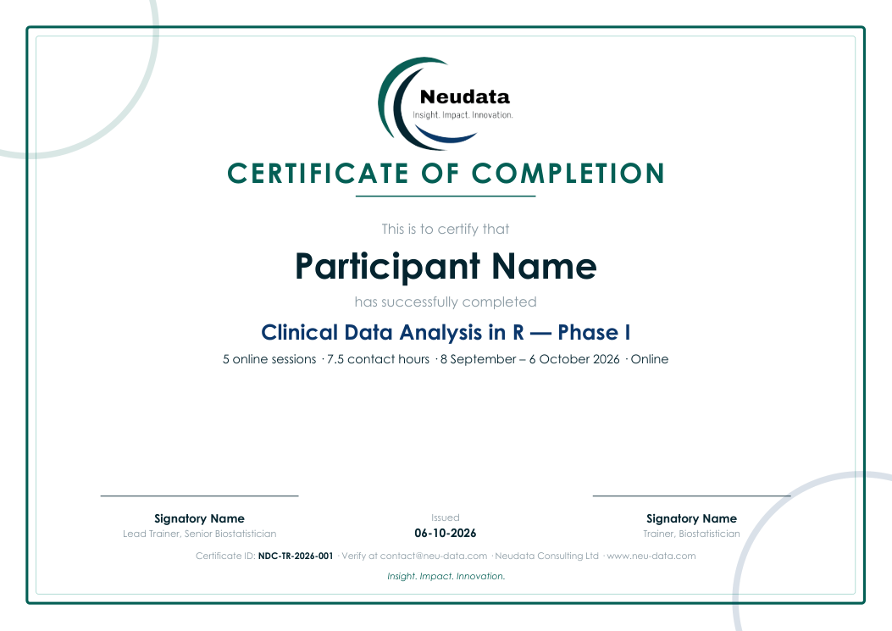

<div align="center">


# Neudata certificate generator

**Branded certificates of completion, generated automatically from a participant list.**




</div>

---

## What it does

- Reads **`participants.csv`** and the course details in **`course.json`**
- Checks each person against the completion criteria (minimum sessions, assignment submitted)
- Writes one **A4 landscape PDF per qualifying participant**: `NDC-TR-2026-001_Nguyen-Thi-Minh-Phuong.pdf`
- Gives every certificate a **unique ID** and records it in **`output/certificates-issued.csv`** — the register used to verify a certificate when someone asks
- Lists everyone who did **not** qualify, with the reason

Names with accents (Vietnamese, French, …) are supported, and long names shrink automatically to fit.

## Requirements

- [Quarto](https://quarto.org) (it includes the Typst typesetting engine) — or RStudio, which bundles Quarto
- Python 3 (standard library only)

## Use it

1. Click **Use this template** (or download the repository).
2. Edit **`course.json`** — course name, dates, hours, location, issue date, ID prefix, criteria and the two signatories.
3. Save the final attendance list as **`participants.csv`** (same columns as [`participants-example.csv`](participants-example.csv)):

   | Column | Required | Notes |
   |---|---|---|
   | `name` | ✅ | Exactly as it should appear on the certificate |
   | `email` | | Kept in the register for sending |
   | `sessions_attended` | | Compared with `min_sessions` |
   | `assignment` | | `yes` / `no`, used when `require_assignment` is `true` |
   | `id` | | Leave blank to generate `NDC-TR-2026-001`, `-002`, … |

4. Run:

   ```bash
   python make_certificates.py
   ```

5. Review the PDFs in `output/`, then send them.

Try it first with the example list:

```bash
python make_certificates.py --participants participants-example.csv
```

## Changing the design

The layout is in [`certificate.typ`](certificate.typ) — logo, colours, wording and signature block. Compile it on its own to preview with sample values:

```bash
quarto typst compile certificate.typ preview.pdf
```

## Data protection

**Never commit real participant lists or issued certificates.** `participants.csv` and everything in `output/` are git-ignored. Keep the issued register in Neudata's secure storage so certificates can be verified later.

---

<div align="center">

**Neudata Consulting Ltd** · *Insight. Impact. Innovation.*
[www.neu-data.com](https://www.neu-data.com) · [contact@neu-data.com](mailto:contact@neu-data.com)

</div>
