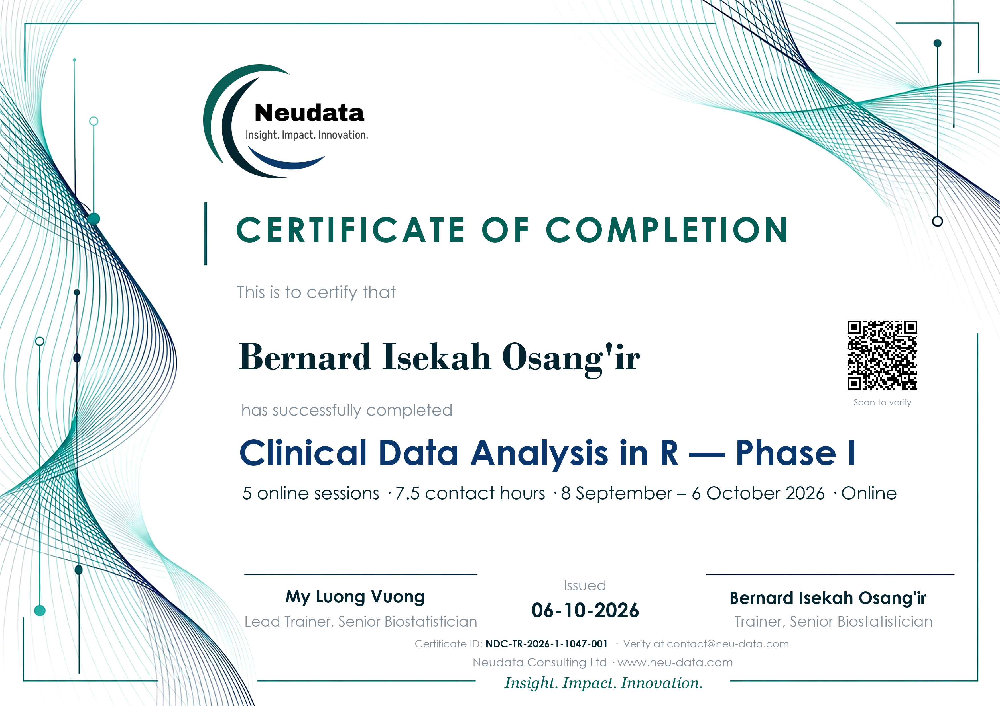

# Neudata certificate portal

A self-service web page where course participants get their certificate:

1. The participant enters their **email**. It is checked against the **eligible list**; if it is on the list, a **6-digit login code** is emailed to them.
2. They enter the **code** and their **official full name**, tick "my name is spelled correctly", and click **Generate my certificate**.
3. The certificate (PDF) is created with their name, both trainers, a **unique ID** (`NDC-TR-2026-1-10XX-NNN`) and a **QR code**, then
   - **emailed** to them (from b.osangir@gmail.com, replies go to contact@neu-data.com), and
   - **saved** in the *Issued certificates* folder, and recorded in the *Certificate register* sheet.
4. Anyone can scan the QR code to open the **verification page**, which confirms the ID, name, course and date.

The page is bilingual (English / Tiếng Việt). It runs as a free Google Apps Script web app in the Neudata Gmail account — no server needed.



## Folders it creates in Google Drive

```
Neudata Certificates/
├── Eligible participants/        ← YOU add one .txt file per person who attended 3–5 sessions
├── Issued certificates/          ← a PDF copy of every certificate (automatic)
├── Certificate register          ← Google Sheet: ID, email, name, dates, status (automatic)
├── Certificate template (do not delete)   ← Google Slides design used for every certificate
├── signature-my-luong.png        ← YOU upload: Lead Trainer's signature (optional)
└── signature-bernard.png         ← YOU upload: Trainer's signature (optional)
```

### Signatures

Upload each trainer's handwritten signature as a PNG (ideally a transparent background) into *Neudata Certificates* with exactly the names above. It is placed above that trainer's signature line on every new certificate; if a file is missing, the certificate is issued without that signature. Signatures stay private in Drive and must **never** be committed to this public repository.

### The eligible list

Create one **.txt file per participant** in *Eligible participants*. The file's **name** is what matters — its contents are ignored (an empty file is fine):

| File name | Means |
|---|---|
| `b.osangir.txt` | b.osangir@**gmail.com** (no @ means a Gmail address) |
| `jane.doe@hospital.org.txt` | jane.doe@hospital.org (use the full address for non-Gmail) |

Gmail ignores dots, capitals and `+tags`, so `bosangir@gmail.com` also matches `b.osangir.txt`. Removing a file stops that person generating a certificate (already-issued ones stay valid).

## One-time setup (about 10 minutes)

Do this signed in as **b.osangir@gmail.com**.

1. Open <https://script.google.com> → **New project**. Rename it *Neudata certificate portal*.
2. **Project Settings** (gear icon) → tick **Show "appsscript.json" manifest file in editor**.
3. In the editor, replace the contents of each file with the ones in [`apps-script/`](apps-script/):
   - `appsscript.json`
   - `Code.gs`
   - **+ → HTML** named `Portal` → paste `Portal.html`
   - **+ → HTML** named `Verify` → paste `Verify.html`
4. Select the function **`setup`** and click **Run**. Approve the permissions (Drive, Sheets, Slides, Gmail, and external requests for the QR code).
   - It creates the folders above and the certificate template.
   - It downloads [`certificate-template.pptx`](certificate-template.pptx) (A4 landscape, background included) from this repository and converts it to Google Slides. If that fails, upload the file into *Neudata Certificates* and run `setup` again.
5. **Deploy → New deployment → Web app**
   - *Execute as:* **Me (b.osangir@gmail.com)**
   - *Who has access:* **Anyone**
   - **Deploy** and copy the **Web app URL** — this is the portal link to share with participants (and add to the course website).
6. Test it: add your own `b.osangir.txt` to *Eligible participants*, open the Web app URL, and go through the steps. Delete the test row from the register and the test PDF afterwards.

After changing `Code.gs` later: **Deploy → Manage deployments → Edit → Version: New version → Deploy** (the URL stays the same).

### Optional: send as contact@neu-data.com

In Gmail (b.osangir@gmail.com): **Settings → Accounts and Import → Send mail as → Add another email address** → `contact@neu-data.com`, using the SMTP details from your Truehost cPanel (server `mail.neu-data.com`). Once that alias is verified, the portal automatically sends from contact@neu-data.com. Until then it sends from b.osangir@gmail.com with replies going to contact@neu-data.com.

## Changing the certificate

The design comes from [`design/certificate-design.webp`](design/certificate-design.webp). `make_background.py` keeps its wave artwork and frame, erases the text, and redraws the logo and all fixed text crisply at print resolution — so the background PNG already contains the title, course, dates, trainers and footer. The portal adds only the **name**, the **certificate ID** and the **QR code**.

| What | Where |
|---|---|
| Course name, dates, hours, issue date, trainers (printed text) | `TEXT` (and `SCALE` for sizes) in `make_background.py` → run it → push the new `certificate-template.pptx` → run `setup` |
| Start over after a design change (your own test certificate) | run `voidMyCertificate` in the editor, then generate again |
| Same details in emails and on the verification page | `CONFIG` at the top of `Code.gs` |
| ID prefix (`NDC-TR-2026-1`) | `CONFIG.idPrefix` in `Code.gs` |
| Name font and size, ID line, QR position | `LAYOUT` in `Code.gs` (values from `layout.json`) |
| Preview locally | `python portal/preview.py "Participant Name"` |

Requires Python with Pillow, OpenCV, NumPy and `qrcode` (`pip install pillow opencv-python numpy qrcode`).

## Rules built in

- **Unique IDs:** `NDC-TR-2026-1-10XX-NNN` — `XX` is random for each participant and `NNN` is a running number, so two people can never get the same ID. Generation is locked so simultaneous clicks cannot collide.
- **One certificate per person:** logging in again re-sends the same certificate and ID; the name cannot be changed. To correct a name, delete that person's row in the register and their PDF, then ask them to generate again.
- **Proof of email ownership:** the 6-digit code (valid 15 minutes, one per minute) means nobody can claim a certificate with someone else's email.
- **No flooding:** a certificate is not re-sent more than once every 10 minutes.
- **Limits:** a personal Gmail account can send about 100 emails a day through Apps Script — plenty for a course cohort.

## Privacy

Participant emails, names and certificates live only in the Neudata Google Drive — never in this public repository.
